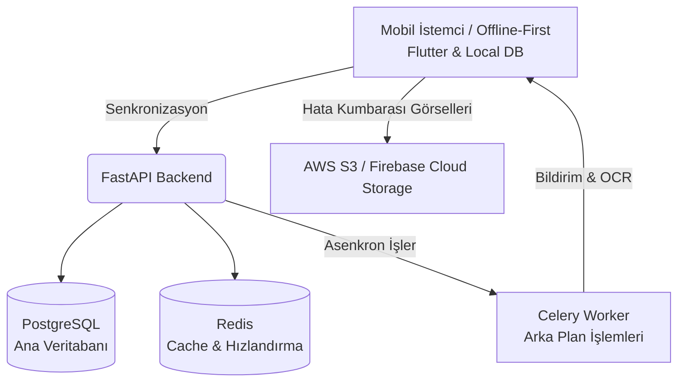
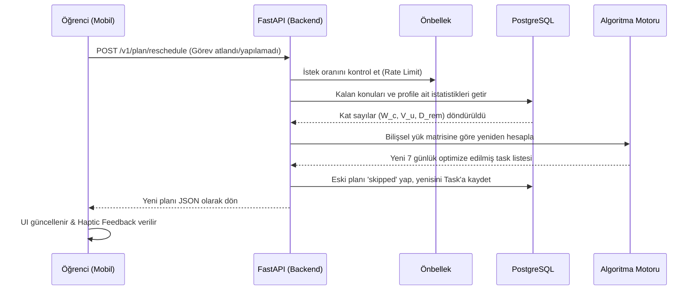
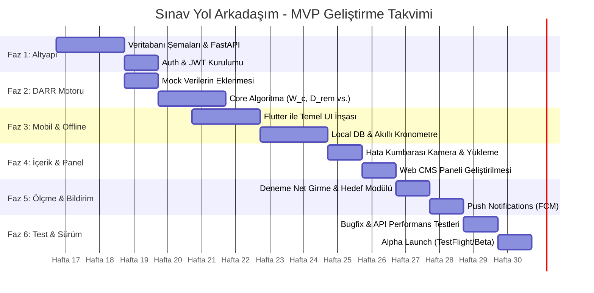

# YKS Sınav Yol Arkadaşım: Kapsamlı LMS Geliştirme Planı

Bu belge, mevcut `Teknik_PRD_Exam.md` dökümanındaki gereksinimleri temel alarak, bir Eğitim Yönetim Sisteminde (LMS) standart olarak bulunması gereken ek modüllerle zenginleştirilmiş geliştirme yol haritasını sunmaktadır.

## 1. Mimari ve Veri Akışı (Sistem Mimarisi)

Aşağıdaki akış şeması, sistemin temel bileşenleri arasındaki veri alışverişini gösterir:

## 2. Standart Bir LMS'te Olması Gereken Ek Özellikler (Gap Analysis)

Mevcut PRD incelendiğinde algoritma odaklı özellikler (DARR, Offline, Hata Kumbarası) uygulamanın temel değer önerisini oluşturuyor. Ancak sistemin eksiksiz ve sürdürülebilir bir LMS (Öğrenim Yönetim Sistemi) kalitesine ulaşabilmesi için aşağıdaki yapıtaşlarının da mimariye eklenmesi gerekir.

| Modül Adı | Mevcut Durum | LMS Gereksinimi | Öncelik (Priority) |
| :--- | :--- | :--- | :--- |
| **Ölçme & İstatistik** | Sadece streak ve stat var | TYT/AYT puanı hesaplama, zayıflık analizi, zamanlı deneme sınavı modülü | 🔴 Yüksek |
| **Gelişmiş İçerik (CMS)** | PRD'de eksik | Yöneticilerin/Öğretmenlerin arayüzden içerik ve soru yükleyebilmesi | 🔴 Yüksek |
| **Kullanıcı & Rol Yönetimi** | Basit yetkilendirme | OAuth, RBAC (Öğrenci, Öğretmen, Admin) Hiyerarşisi | 🔴 Yüksek |
| **Hedef Belirleme** | PRD'de eksik | Üniversite hedefine uzaklık grafikleri ve motivasyon barları | 🟡 Orta |
| **Mentörlük Paneli** | Bireysel | Rehber öğretmenin öğrenci ilerlemesini görebileceği admin web paneli | 🟡 Orta |
| **Abonelik Sistemi** | Belirsiz | Freemium modeli, In-app purchase (Iyzico/RevenueCat) | 🟡 Orta |
| **Oyunlaştırma (Gamification)** | Streak mevcut | Rozetler (Örn: 5 gündür aksatmadın), Liderlik Tabloları | 🟢 Düşük |

## 3. DARR Algoritması Çalışma Akışı (Flowchart)

Kullanıcı planda bir aksama yaşadığında arka planda çalışan sistemin akışı:

## 4. Geliştirme Yol Haritası (Gantt Şeması ve Fazlar)

Projeyi test edilebilir seviyelerde tutmak adına 14 Haftalık bir süreç kurgulanmıştır:

### Detaylı Faz Açıklamaları:
* **Faz 1 (Temel Altyapı - 1. ve 2. Hafta):** PRD'deki veritabanı tablolarının (Users, Tasks, User_Stats vb. dahil) çıkarılması, Docker ile mimari kurulumu, sisteme giriş (Login) akışları.
* **Faz 2 (DARR Yapıtaşı - 3. - 5. Hafta):** Matematiksel algoritma formüllerinin (Bilişsel Yük, Ağırlık) backend'e dökülmesi ve kritik Edge Case senaryolarının (Gece vardiyası, Midnight Reset vb.) Unit Test senaryolarıyla kapatılması.
* **Faz 3 (Offline Deneyim - 6. - 8. Hafta):** İnternet kopmalarına dayanıklı Local Storage destekli UI, Pomodoro/Kronometre ekranları ve çakışma çözen (conflict resolving) senkronizasyon araçları.
* **Faz 4 (Görsel İçerik - 9. ve 10. Hafta):** Etkileşimli CMS (Web) panelinin yapılıp "İstanbul Modu" verilerinin bağlanması. Hata kumbarası görsellerinin S3'e ulaştırılması.
* **Faz 5 (Ölçme Değerlendirme - 11. ve 12. Hafta):** Rozet, deneme sonuç testleri (AYT/TYT simulasyon arayüzü), geri bildirim döngüleri. *Hala çalışıyor musun?* gibi notification uyarılarının entegresi.
* **Faz 6 (Alpha Çıkışı - 13. ve 14. Hafta):** API hız optimizasyonu (300ms altı kuralı) ve belirlenen ilk çekirdek kullanıcı kitlesiyle beta sürüm izleme denemeleri.

---

## 5. Tavsiye Edilen Teknoloji Yığını (Tech Stack)

| Katman | Teknoloji / Framework | Tercih Nedeni |
| :--- | :--- | :--- |
| **Backend API** | FastAPI (Python) | PRD'ye tam uyumlu. Algılatmalar, optimizasyon hesapları (Python) ve asenkron operasyonlar için mükemmel bir iskelet. Çok hızlı. |
| **Veritabanı** | PostgreSQL | İlişkisel veriler, bağımlılıklar (Örn: Tasks, Exams) için altın standart. |
| **Cache (Önbellek)** | Redis | API isteklerindeki hızı 300ms altına düşürmek için gerekli. |
| **Mobil Uygulama** | Flutter | Tek kod bloğu ile iOS/Android çıkışı. Offline-First yapısı (Hive vb. ile) PRD'nin çevrimdışı önceliği için harika olur. |
| **Medya & CDN** | AWS S3 / Firebase Storage | Yanlış soruların resimleri, "İstanbul Modu" imajlarını barındırma işlemleri. |
| **CMS Web Paneli** | React.js & TailwindCSS | Rehber Öğretmenler ve Editörler için hafif, çok temiz yönetim paneli. |
| **Görev Dağıtıcı** | Celery | Öğrencinin test analizleri hesaplanırken asenkron işlem için; veya fotoğraflara OCR özelliği gelirse sistemi tıkamaması için. |
