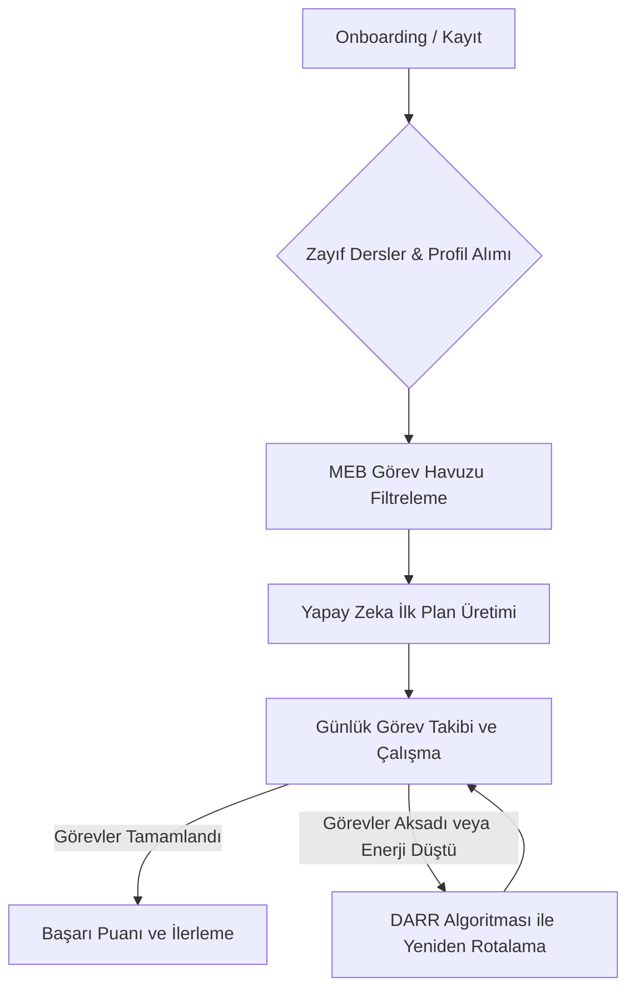

# YKS Yapay Zeka Planlama ve Pedagoji Metodolojisi

Bu belge, uygulamanın arka planında çalışan sistem mantığını, yapay zekanın (Gemini API) nasıl konumlandırıldığını, kullanılan prompt mühendisliği yaklaşımlarını ve uygulanan pedagojik/mantıksal yöntemleri detaylandırmaktadır.

---

## 1. Programın Genel Çalışma Mantığı (System Logic Flow)

Uygulama, YKS (TYT ve AYT) sınavına hazırlanan öğrencilerin kişiselleştirilmiş bir çalışma takvimi oluşturmasını, bunu takip etmesini ve aksama durumlarında dinamik olarak planı yeniden şekillendirmesini sağlar. Süreç şu temel adımlardan oluşur:

### Temel Akış Adımları:
1. **Profil ve Hedef Belirleme (Onboarding):** Kayıt sırasında öğrenciden Ad Soyad, Hedef Alan (Sayısal, Eşit Ağırlık, Sözel, Dil), Haftalık Çalışma Saati (10-20, 20-30, 30+ saat), En Verimli Çalışma Zamanı (Sabah, Öğleden Sonra, Akşam) ve **TYT ile AYT için ayrı ayrı zayıf olduğu dersler** alınır.
2. **Görev Havuzu (Task Library):** Sistemde MEB müfredatına uygun olarak hazırlanmış, her ders ve konuya ait zorluk seviyeleri (Kolay, Orta, Zor) ve tahmini süreleri (dakika cinsinden) belirlenmiş hazır bir görev kütüphanesi bulunur.
3. **İlk Plan Oluşturma:** Öğrenci sisteme ilk girdiğinde (veritabanında aktif görevi yoksa), profiliyle eşleşen görev şablonları havuzdan süzülür ve Gemini API'sine gönderilerek 7 günlük kişiye özel dengeli bir başlangıç planı oluşturulur.
4. **Çalışma Takibi:** Öğrenci günlük görevlerini tamamladıkça bunları "completed" olarak işaretler. Yapılmayan görevler ise aksayan görevler durumuna düşer.

---

## 2. Yapay Zekanın Çalışma Mantığı (AI Engine & Prompt Engineering)

Sistemde yapay zeka, **Gemini 2.5 Flash / Gemini 1.5 Flash** modelleriyle entegre çalışır. Plana dair tüm kararlar rastgelelikten uzak, pedagojik kurallara bağlı ve yapılandırılmış prompt'larla yönetilir.

### A. İlk Planlama Prompt Tasarımı ve Kısıtları
Yapay zeka ilk planı yaparken aşağıdaki parametreleri girdi olarak alır:
* Öğrencinin zayıf olduğu TYT ve AYT dersleri.
* Öğrencinin haftalık ayırabileceği toplam saat ve verimli saat dilimi.
* MEB Görev Havuzunun filtrelenmiş JSON listesi.

Yapay zekanın uyması gereken **Kesin Kurallar** şunlardır:
* **Görev Uydurmama:** Sadece sağlanan MEB görev havuzundaki gerçek ID'leri kullanabilir.
* **Odaklanma Kuralı:** Planlanan görevlerin en az %60'ı öğrencinin zayıf olduğunu belirttiği derslerden seçilmelidir.
* **İlk Gün Isınma Kuralı (Day 1 Icebreaker):** Öğrencinin uygulamadaki 1. Günü (day_offset: 0) ısınma turudur. Bu güne atanan tüm görevler istisnasız "Kolay" seviyede olmak zorundadır.
* **Kronolojik Zorluk İlerlemesi:** Bir dersten plana birden fazla görev eklendiğinde, kolay görevin gün sapması (`day_offset`) orta veya zor görevden kesinlikle daha küçük (takvimde daha önce) olmak zorundadır.
* **Eş Zamanlı Sarmal İlerleme (TYT & AYT Ön Koşul Zinciri):** TYT ve AYT konuları paralel olarak eş zamanlı yürütülebilir (örneğin TYT Problemler ile AYT Logaritma aynı günlerde çalışılabilir). Ancak, sarmal öğrenme yapısı gereği kesin ön koşul kurallarına uyulmalıdır:
  * Matematik: `Fonksiyonlar` bitmeden `Türev`, `Türev` bitmeden `İntegral` planlanamaz (Fonksiyonlar <= Türev <= İntegral gün sapması ile).
  * Fizik: `Newton'ın Hareket Yasaları` bitmeden `Basit Harmonik Hareket` planlanamaz.
  * Kimya: `Kimya Bilimi & Atomun Yapısı` bitmeden `Organik Kimya` planlanamaz.
  * Biyoloji: `Canlıların Ortak Özellikleri & Hücre` bitmeden `İnsan Fizyolojisi & Sistemler` planlanamaz.
* **Haftalık Dengeli Dağılım:** Görevler 7 güne yayılmalıdır. Aynı güne 3'ten fazla görev yığılmamalı ve günlük çalışma süresi 150-180 dakikayı aşmamalıdır.

### B. Few-Shot Prompting (Az Örnekli Öğrenme)
Yapay zekanın kurallara tam uyması ve mantıksal hatalar yapmaması için sistem promptunda pozitif ve negatif örnekler sunulmaktadır:
* *Yanlış Planlama (1. Gün Faciası):* `[Matematik-İntegral (Zor, day_offset: 0)]` -> Hata: İlk gün zor görev olamaz.
* *Doğru Planlama (Pedagojik İlerleme):* `[Matematik-Sayılar (Kolay, day_offset: 0), Matematik-Üslü Sayılar (Orta, day_offset: 1), Matematik-İntegral (Zor, day_offset: 2)]` -> Temel konular önce planlanmış, kolaydan zora hiyerarşik ilerleme yapılmıştır.

---

## 3. Pedagojik ve Mantıksal Yöntemlerimiz

Uygulamanın temel amacı, öğrencinin sınav hazırlık sürecinde **tükenmişlik (burnout)** yaşamasını engellemek, **sürekliliği (retention)** artırmak ve **verimli öğrenmeyi** maksimize etmektir. Bunun için şu pedagojik yöntemler sisteme gömülmüştür:

### 1. Truva Atı Yaklaşımı ve Güven İnşası (Confidence Building)
* **Kural:** Öğrencinin plana başladığı ilk 3 gün (day_offset: 0, 1 ve 2) tamamen Güven İnşası dönemidir. Bu günlerde plana zayıf ders görevi veya Orta/Zor seviye görev eklenmez. Yalnızca öğrencinin güçlü/nötr olduğu derslerden "Kolay" seviyede görevler atanır.
* **Pedagojik Amacı:** Öğrencinin uygulamaya başladığı ilk anlarda "yapabiliyorum" hissini yaşayarak dopamin salgılamasını, görevleri tamamlayıp "tik" atma hazzıyla Streak (seri yapma) alışkanlığına girmesini sağlar. Uygulama ile öğrenci arasında ilk sarsılmaz güven bağını kurar (Retention & Churn önleme).
* **UI/UX Isınma Desteği:** İlk 3 günün başlığı (day_offset: 0 için) arayüzde dinamik olarak **"🔥 Bugün (Isınma Turu)"** şeklinde etiketlenerek öğrencinin stres düzeyi azaltılır.
* **Zorluk Etiketlerinin Gizlenmesi (Bilişsel Rahatlatma):** Görev isimlerinin sonundaki `(Kolay)`, `(Orta)`, `(Zor)` ifadeleri arayüzde öğrenciden gizlenir. Arka planda yapay zeka zorluk sıralamasına tam olarak uyar, ancak öğrenciye bu etiketleri göstermemek zihinsel baskıyı (procrastination tetikleyicilerini) azaltır.

### 2. Zayıf Derslere Yavaşça Sızma (Progressive Exposure)
* **Kural:** Onboarding'de toplanan zayıf dersler, ilk planın başından itibaren yığılmaz. Bunun yerine, 4. günden (day_offset: 3) itibaren plana yavaşça dahil edilir. Zayıf dersin ilk görevi kesinlikle "Kolay" seviyede ve kısa süreli (20-30 dakika) bir mikro-görev olmalı, güçlü derslerin arasına tamponlanmalıdır.
* **Pedagojik Amacı:** Öğrencinin zayıf olduğu derslere karşı geliştirdiği bilinçaltı ön yargıyı ve savunma mekanizmasını tetiklemeden, dersi "kolay ve acısız" bir şekilde zihin alanına sokar. Öğrenci zorlanmadığını görünce konuya karşı özgüven (Self-efficacy) geliştirir.

### 2. Block Scheduling (Blok Çalışma) ve Context Switching (Bağlam Değiştirme) Dengesi
* **Kural:** Bir günde ardı ardına aynı dersten **en fazla 2 görev** planlanabilir (Örn: Matematik -> Matematik). Bir günde tek bir derse 3 veya daha fazla görev yığılamaz; araya mutlaka farklı bir ders veya dinlenme konmalıdır.
* **Pedagojik Amacı:** 
  * *Context Switching (Bağlam Değiştirme) Maliyeti:* Zihin her farklı derse geçiş yaptığında odaklanma süresi sıfırlanır ve yorulur. Bu yüzden ardışık 2 görevle derinlemesine odaklanma (**Deep Work**) desteklenir.
  * *Bilişsel Doyum Sınırı:* Ancak 3. saatten sonra aynı dersi çalışmak verimi düşürür. Sistem bu noktada dersi değiştirerek zihni taze tutar.

### 3. Bilişsel Yük Dengesi (Cognitive Load Management)
* **Kural:** İki ağır sayısal ders (Örn: Matematik ve Fizik ya da Fizik ve Kimya) veya iki "Zor" seviyedeki görev asla peş peşe planlanamaz. Araya mutlaka sözel bir ders (Türkçe, Tarih vb.) veya daha hafif bir pratik görevi tampon olarak yerleştirilir.
* **Pedagojik Amacı:** Sol beyin lobunu aşırı yoran sayısal mantıksal süreçlerin ardışık gelmesi zihinsel tükenmeyi hızlandırır. Dağınık mod (Diffuse Mode) öğrenmesini desteklemek için zihinsel dinlenme aralıkları oluşturulur.

---

## 4. DARR (Dinamik Adaptif Yeniden Rotalama) Algoritması

Öğrenciler robot değildir; hastalık, motivasyon kaybı veya dış etkenler nedeniyle planları aksayabilir. Geleneksel planlayıcılar kaçırılan günleri üst üste yığarak öğrenciyi suçluluk psikolojisine sürükler. Bizim sistemimiz ise **DARR (Dynamic Adaptive Road Re-routing)** motorunu kullanır.

### Çalışma Şekli:
Öğrenci "Planımı Yeniden Düzenle" dediğinde sistem şu verileri toplar:
1. Sınava kalan gün sayısı (`remaining_days`).
2. Öğrencinin o anki öz bildirimli Enerji Seviyesi (`energy_level`: 1 - 5 arası).
3. Yapılamayan/aksayan görevler ile gelecekteki görevler.

### Enerji Duyarlı Dağıtım Mantığı:
* **Düşük Enerji (1-2):** Yapay zeka veya yedek matematiksel motor, zor/uzun görevleri takvimin ilerleyen günlerine öteler. İlk günlere daha kısa, kolay veya sözel görevleri koyarak öğrenciyi yavaşça tekrar ritme sokar (Safe Default / Churn Önleme).
* **Tembelik Kilidi (Anti-Abuse / Suistimal Önleme):** Öğrencinin "Düşük Enerji" modunu suistimal edip çalışmaktan kaçmasını engellemek için iki aşamalı güvenlik mekanizması devrededir:
  1. **Minimum Çalışma Barajı (Backend):** Enerji seviyesi en düşük (1 veya 2) seçilse bile, günlük toplam planlanan çalışma süresi hiçbir koşulda **120 dakikanın** altına indirilemez.
  2. **Yumuşak Geçit (Frontend Soft-Gate):** Öğrenci üst üste 3 kez düşük enerji seviyesi (1 veya 2) seçtiğinde, planı güncellemeden önce arayüzde *"Meydan Okuma Zamanı! 🎯"* uyarısı çıkarılır. Bu uyarı öğrenciye YKS sürecinde disiplin ve sürekliliği hatırlatarak kendini zorlamaya teşvik eder.
* **Yüksek Enerji (4-5):** Yapay zeka öğrencinin dinç olduğunu varsayarak en zor konuları ve yoğun çalışma bloklarını en yakın günlere yerleştirir.

### Matematiksel Fallback Motoru (Gemini Kapalıyken):
Eğer API sınırları veya internet kesintisi nedeniyle yapay zekaya erişilemezse, arka planda çalışan kural tabanlı matematiksel DARR motoru devreye girer. Bu motor her görev için bir **Öncelik Puanı (Priority Score)** hesaplar:

$$\text{Priority Score} = \frac{\text{Müfredat Ağırlığı (Weight)} \times 100}{\text{Kalan Gün} \times \text{Günlük Hedef Saat} \times \text{Enerji Faktörü}}$$

* Burada derslerin YKS katsayıları (`weight`) kullanılır (Örn: İntegral = 2.2, Limit = 1.6, Temel Fizik = 1.0).
* **Ön Koşul Çözümleyici (Prerequisite Resolver):** Matematiksel fallback motoru, sarmal müfredat yapısını korumak amacıyla ön koşul kontrolü yapar. Eğer bir hedef konunun (örn. İntegral) ön koşulları (örn. Fonksiyonlar ve Türev) henüz tamamlanmamışsa, ön koşul görevlerinin öncelik puanları hedef görevden daha yüksek olacak şekilde otomatik yükseltilir. Böylece takvim sıralamasında ön koşullar kesinlikle daha önce planlanır.
* Hesaplanan puanlara göre görevler sıralanır ve bilişsel yük kuralları gözetilerek (aynı güne 2 'Zor' gelmeyecek şekilde) 7 günlük sepetlere dağıtılır.

---

## 5. Hata Kumbarası ve Yapay Zeka Çözümleyici

Öğrenmenin en etkili yollarından biri hatalardan ders çıkarmaktır (Mistake-Driven Learning). Hata Kumbarası modülü bu pedagojiyi dijitalleştirir:

* **Süreç:** Öğrenci yapamadığı veya yanlış yaptığı sorunun fotoğrafını çeker ve uygulamaya yükler.
* **Yapay Zeka Analizi:** Gemini Vision modülü resimdeki soruyu okur (OCR):
  1. Sorunun hangi derse (MATEMATİK, FİZİK, KİMYA, BİYOLOJİ, TÜRKÇE) ait olduğunu belirler.
  2. Müfredattaki alt konu başlığını (Örn: Logaritma, Optik vb.) ve zorluk seviyesini tespit eder.
  3. Adım adım, açıklayıcı, formüllerin mantığını anlatan pedagojik bir çözüm üretir.
* **Tekrar Mekanizması:** Bu sorular Hata Kumbarasında saklanır ve öğrenci dilerse ilerleyen günlerde bu hataları tekrar çözerek öğrenmeyi kalıcı hale getirir.

---

## 6. Mevcut Sistem Limitleri ve Gelecek Yol Haritası (Product Roadmap)

Platformumuzun MVP (Minimum Uygulanabilir Ürün) aşamasından tam ölçekli, veri odaklı bir öğrenme asistanına evrilmesi sürecinde, kullanıcı sürtünmesini azaltmak ve tahmin doğruluğunu artırmak adına aşağıdaki mimari geliştirmeler yol haritamıza eklenmiştir:

### A. Enerji Seviyesi Girişindeki Sürtünmenin Giderilmesi (Zero-UI ve Pasif Algılama)
* **Mevcut Durum (MVP):** Kullanıcı DARR tetiklendiğinde enerji seviyesini (1-5) manuel olarak girmek durumundadır. Bu durum, tükenmiş bir öğrencide angaryaya dönüşebilir ve sürekli "3" seçerek veri kirliliğine yol açabilir.
* **Gelecek Çözüm (Implicit Sensing):** Kullanıcının enerji seviyesini manuel sormak yerine uygulamadaki davranış ayak izlerinden tahmin eden pasif bir veri modeli uygulanacaktır:
  * **Çalışma Hızı:** Görevlerin tamamlanma sürelerindeki sapmalar (Örn: 30 dakikalık görevin 60 dakikada bitmesi).
  * **Erteleme (Skip) Oranı:** Son 48 saatte ötelenen görev miktarı.
  * **Uygulama Giriş Rutini:** Giriş saatlerindeki sapmalar ve uygulama içindeki gezinti hızları.
  * **Akıllı Opt-Out Bildirimi:** DARR tetiklendiğinde kullanıcıya "Enerjin kaç?" sorusu yerine, arka planda hesaplanan bilişsel yorgunluk indeksine göre *"Çalışma performansına göre enerjini biraz düşük tespit ettik ve planını %40 oranında hafiflettik. Eğer öyle değilse normal plana dönmek için buraya tıkla"* şeklinde sürtünmesiz bir deneyim sunulacaktır.

### B. Onboarding'deki "Zayıf Ders" Yüzeyselliğinin Aşılanması (Dinamik Profilleme)
* **Uygulanan Durum (Kademeli Profil Oluşturma - Progressive Profiling):** Mobil onboarding ekranlarında (Adım 4 ve Adım 5) bir ders seçildiğinde, o dersin en çok zorluk yaşanabilecek alt alanları (Örn: Matematik için *Sayılar & Cebir, Problemler, Trigonometri, Fonksiyonlar, LTI (Türev & İntegral)* vb.) anında açılan dinamik mikro-çipler şeklinde listelenir. Kullanıcının seçtiği bu detaylı alt konular, arka plana gönderilen `target_goal` (Zayıf Alanlar) verisine işlenerek ilk planın kalitesini artırır.
* **Gelecek Geliştirme (Hata Kumbarası Geri Beslemesi - Feedback Loop):**
  * **Hata Kumbarası Geri Besleme Döngüsü:** İlk plan onboarding'deki alt konu seçimleriyle başlar. Ancak öğrenci Hata Kumbarası'na çözemediği soruları yükledikçe ve yapay zeka bu soruları alt konularına göre etiketledikçe (Örn: "Trigonometri"), öğrencinin "zayıf ders" profili arka planda otomatik olarak güncellenir.
  * **Dinamik Müfredat Ayarlaması:** Yapay zeka sonraki haftalık planları oluştururken onboarding'deki ilk beyana değil, hata kumbarası ve görev başarı oranlarından elde edilen dinamik zayıf konu verilerine odaklanacaktır.

